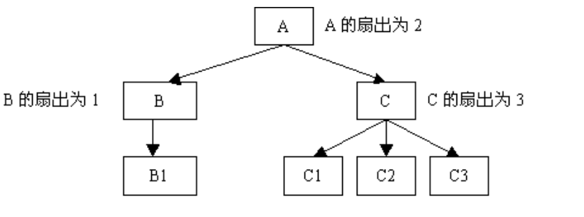

# C语言技术规范
------------------------------------------------
<!-- TOC -->

- [# C语言技术规范](#h1-idc语言技术规范-1627c语言技术规范h1)
- [1.头文件](#1头文件)
  - [规则1.1 源文件后缀用小写字母.c和.h。](#规则11-源文件后缀用小写字母c和h)
  - [规则1.2 每一个.c文件应有一个同名.h文件，用于声明需要对外公开的接口。](#规则12-每一个c文件应有一个同名h文件用于声明需要对外公开的接口)
  - [规则1.3 禁止头文件循环依赖。](#规则13-禁止头文件循环依赖)
  - [规则1.4 .c/.h文件禁止包含用不到的文件。](#规则14-ch文件禁止包含用不到的文件)
  - [规则1.5 头文件应当自包含。](#规则15-头文件应当自包含)
  - [规则1.6 总是编写内部#include保护符（#define保护）。](#规则16-总是编写内部include保护符define保护)
  - [规则1.7 禁止在头文件中定义变量。](#规则17-禁止在头文件中定义变量)
  - [规则1.8 只能通过包含头文件的方式使用其他.c提供的接口，禁止在.c中通过extern的方式使用外部函数接口、变量。](#规则18-只能通过包含头文件的方式使用其他c提供的接口禁止在c中通过extern的方式使用外部函数接口变量)
  - [规则1.9 禁止在extern "C"中包含头文件。](#规则19-禁止在extern-c中包含头文件)
- [2.函数](#2函数)
  - [规则2.1 一个函数仅完成一个基本功能。](#规则21-一个函数仅完成一个基本功能)
  - [规则2.2 重复代码应提炼成函数。](#规则22-重复代码应提炼成函数)
  - [规则2.3 避免函数过长，新增函数不超过50行（非空非注释行）。](#规则23-避免函数过长新增函数不超过50行非空非注释行)
  - [规则2.4 避免函数的代码块嵌套过深，新增函数的代码块嵌套不超过4层。](#规则24-避免函数的代码块嵌套过深新增函数的代码块嵌套不超过4层)
  - [规则2.5 可重入函数应避免使用共享变量；若需要使用，则应通过互斥手段（关中断、信号量）对其加以保护。](#规则25-可重入函数应避免使用共享变量若需要使用则应通过互斥手段关中断信号量对其加以保护)
  - [规则2.6 对参数的合法性检查，由调用者负责还是由接口函数负责，应在项目组/模块内应统一规定。缺省由调用者负责。](#规则26-对参数的合法性检查由调用者负责还是由接口函数负责应在项目组模块内应统一规定缺省由调用者负责)
  - [规则2.7 对函数的错误返回码要全面处理。](#规则27-对函数的错误返回码要全面处理)
  - [规则2.8 废弃代码（没有被调用的函数和变量)及时清除。](#规则28-废弃代码没有被调用的函数和变量及时清除)
  - [规则2.9 设计高扇入，合理扇出（小于7）的函数。](#规则29-设计高扇入合理扇出小于7的函数)
- [3. 标识符命名和定义](#3-标识符命名和定义)
  - [规则3.1 产品/项目组内部应保持统一的命名风格。](#规则31-产品项目组内部应保持统一的命名风格)
  - [规则3.2 标识符的命名要有明确含义，同时使用完整的单词或大家基本可以理解的缩写，避免使人产生误解。](#规则32-标识符的命名要有明确含义同时使用完整的单词或大家基本可以理解的缩写避免使人产生误解)
  - [规则3.3 除了常见的通用缩写以外，不使用单词缩写，不使用汉语拼音。](#规则33-除了常见的通用缩写以外不使用单词缩写不使用汉语拼音)
  - [规则3.4 文件命名统一采用小写字符。](#规则34-文件命名统一采用小写字符)
  - [规则3.5 全局变量应增加“g_”前缀。](#规则35-全局变量应增加g_前缀)
  - [规则3.6 静态变量应增加“s_”前缀。](#规则36-静态变量应增加s_前缀)
  - [规则3.7 禁止使用单字节命名变量，但允许定义i、j、k作为局部循环变量。](#规则37-禁止使用单字节命名变量但允许定义ijk作为局部循环变量)
  - [规则3.8 函数命名应以函数要执行的动作命名，一般采用动词或者动词＋名词的结构。](#规则38-函数命名应以函数要执行的动作命名一般采用动词或者动词名词的结构)
  - [规则3.9 函数指针除了前缀，其他按照函数的命名规则命名。](#规则39-函数指针除了前缀其他按照函数的命名规则命名)
  - [规则3.10 对于数值或者字符串等等常量的定义，建议采用全大写字母，单词之间加下划线”_”的方式命名（枚举同样建议使用此方式定义）。](#规则310-对于数值或者字符串等等常量的定义建议采用全大写字母单词之间加下划线_的方式命名枚举同样建议使用此方式定义)
  - [规则3.11 除了头文件或编译开关等特殊标识定义，宏定义不能使用下划线”_”开头和结尾。](#规则311-除了头文件或编译开关等特殊标识定义宏定义不能使用下划线_开头和结尾)
- [4.变量](#4变量)
  - [规则4.1 防止局部变量与全局变量同名。](#规则41-防止局部变量与全局变量同名)
  - [规则4.2 严禁使用未经初始化的变量作为右值。](#规则42-严禁使用未经初始化的变量作为右值)
  - [规则4.3 构造仅有一个模块或者函数可以修改、创建，而其余有关模块或函数只访问的全局变量，防止多个不同模块或函数都可修改、创建同一全局变量的现象。](#规则43-构造仅有一个模块或者函数可以修改创建而其余有关模块或函数只访问的全局变量防止多个不同模块或函数都可修改创建同一全局变量的现象)
  - [规则4.4 在首次使用前初始化变量，初始化的地方离使用的地方越近越好。](#规则44-在首次使用前初始化变量初始化的地方离使用的地方越近越好)
  - [规则4.5 明确全局变量的初始化顺序，避免跨模块的初始化依赖。](#规则45-明确全局变量的初始化顺序避免跨模块的初始化依赖)
- [5.宏、常量](#5宏常量)
  - [规则5.1 用宏定义表达式时，要使用完备的括号。](#规则51-用宏定义表达式时要使用完备的括号)
  - [规则5.2 将宏所定义的多条表达式写成do{}while(0)的方式。](#规则52-将宏所定义的多条表达式写成dowhile0的方式)
  - [规则5.3 使用宏时，不允许参数发生变化。](#规则53-使用宏时不允许参数发生变化)
  - [规则5.4 不允许直接使用魔鬼数字。](#规则54-不允许直接使用魔鬼数字)
- [6.质量保证](#6质量保证)
  - [规则6.1 代码质量保证优先级从高到低：正确性->简洁性->可维护性->可靠性->代码可测性->代码性能高效->可移植性->个人方便性。](#规则61-代码质量保证优先级从高到低正确性-简洁性-可维护性-可靠性-代码可测性-代码性能高效-可移植性-个人方便性)
  - [规则6.2 禁止内存操作越界。](#规则62-禁止内存操作越界)
  - [规则6.3 禁止内存泄漏。](#规则63-禁止内存泄漏)
  - [规则6.4 禁止引用已经释放的内存空间。](#规则64-禁止引用已经释放的内存空间)
  - [规则6.5 所有的if ... else if结构应该由else子句结束；switch语句必须有default分支。](#规则65-所有的if--else-if结构应该由else子句结束switch语句必须有default分支)
  - [规则6.6 函数中分配的内存，在函数退出之前要释放。](#规则66-函数中分配的内存在函数退出之前要释放)
- [7.注释](#7注释)
  - [规则7.1 尽量做到代码的自我解释，实现不通过注释即可轻易读懂。](#规则71-尽量做到代码的自我解释实现不通过注释即可轻易读懂)
  - [规则7.2 对代码的功能、意图进行注释，即解释代码难以直接表达的意图，而不是重复描述代码。](#规则72-对代码的功能意图进行注释即解释代码难以直接表达的意图而不是重复描述代码)
  - [规则7.3 修改代码时，维护代码周边的所有注释，以保证注释与代码的一致性。不再有用的注释要删除。](#规则73-修改代码时维护代码周边的所有注释以保证注释与代码的一致性不再有用的注释要删除)
  - [规则7.4 文件头部应进行注释，注释必须列出：版权说明、版本号、生成日期、作者姓名、工号、内容、功能说明、与其它文件的关系、修改日志等，头文件的注释中还应有函数功能简要说明。](#规则74-文件头部应进行注释注释必须列出版权说明版本号生成日期作者姓名工号内容功能说明与其它文件的关系修改日志等头文件的注释中还应有函数功能简要说明)
  - [规则7.5 函数声明处注释描述函数功能、性能及用法，包括输入和输出参数、函数返回值、可重入的要求等。](#规则75-函数声明处注释描述函数功能性能及用法包括输入和输出参数函数返回值可重入的要求等)
  - [规则7.6 全局变量要有较详细的注释，包括对其功能、取值范围以及存取时注意事项等的说明。](#规则76-全局变量要有较详细的注释包括对其功能取值范围以及存取时注意事项等的说明)
  - [规则7.7 注释应放在其代码上方相邻位置或右方，不可放在下面。如放于上方则需与其上面的代码用空行隔开，且与下方代码缩进相同。](#规则77-注释应放在其代码上方相邻位置或右方不可放在下面如放于上方则需与其上面的代码用空行隔开且与下方代码缩进相同)
  - [规则7.8 对于switch语句下的case语句，如果因为特殊情况需要处理完一个case后进入下一个case处理，必须在该case语句处理完、下一个case语句前加上明确的注释。](#规则78-对于switch语句下的case语句如果因为特殊情况需要处理完一个case后进入下一个case处理必须在该case语句处理完下一个case语句前加上明确的注释)
  - [规则7.9 避免在注释中使用缩写，除非是业界通用或子系统内标准化的缩写。](#规则79-避免在注释中使用缩写除非是业界通用或子系统内标准化的缩写)
  - [规则7.10 同一产品或项目组统一注释风格。](#规则710-同一产品或项目组统一注释风格)
- [8.排版与格式](#8排版与格式)
  - [规则8.1 程序块采用缩进风格编写，每级缩进为4个空格。](#规则81-程序块采用缩进风格编写每级缩进为4个空格)
  - [规则8.2 相对独立的程序块之间、变量说明之后必须加空行。](#规则82-相对独立的程序块之间变量说明之后必须加空行)
  - [规则8.3 一条语句不能过长，如不能拆分需要分行写。一行到底多少字符换行比较合适，产品可以自行确定。](#规则83-一条语句不能过长如不能拆分需要分行写一行到底多少字符换行比较合适产品可以自行确定)
  - [规则8.4 多个短语句（包括赋值语句）不允许写在同一行内，即一行只写一条语句。](#规则84-多个短语句包括赋值语句不允许写在同一行内即一行只写一条语句)
- [### 规则8.5 if、for、do、while、case、switch、default等语句独占一行。](#h3-id规则85-iffordowhilecaseswitchdefault等语句独占一行-685规则85-iffordowhilecaseswitchdefault等语句独占一行h3)
- [9.表达式](#9表达式)
  - [规则9.1 表达式的值在标准所允许的任何运算次序下都应该是相同的。](#规则91-表达式的值在标准所允许的任何运算次序下都应该是相同的)
  - [规则9.2 赋值语句不要写在if等语句中，或者作为函数的参数使用。](#规则92-赋值语句不要写在if等语句中或者作为函数的参数使用)
  - [规则9.3 用括号明确表达式的操作顺序，避免过分依赖默认优先级。](#规则93-用括号明确表达式的操作顺序避免过分依赖默认优先级)
- [10.代码编辑、编译](#10代码编辑编译)
- [### 规则10.1 使用编译器的最高告警级别，理解所有的告警，通过修改代码而不是降低告警级别来消除所有告警。](#h3-id规则101-使用编译器的最高告警级别理解所有的告警通过修改代码而不是降低告警级别来消除所有告警-449规则101-使用编译器的最高告警级别理解所有的告警通过修改代码而不是降低告警级别来消除所有告警h3)
- [11.合法性检查](#11合法性检查)
  - [规则11.1 确保所有字符串是以’\0’结束。](#规则111-确保所有字符串是以0结束)
  - [规则11.2 长度范围不明确的字符串不可写到固定长度的数组中。](#规则112-长度范围不明确的字符串不可写到固定长度的数组中)
  - [规则11.3 避免数据溢出。](#规则113-避免数据溢出)
  - [规则11.4 避免符号转换错误。](#规则114-避免符号转换错误)
  - [规则11.5 避免截断错误。](#规则115-避免截断错误)
  - [规则11.6 避免使用strlen()计算二进制数据的长度。](#规则116-避免使用strlen计算二进制数据的长度)
  - [规则11.7 使用int类型变量来接收字符I/O函数的返回值。](#规则117-使用int类型变量来接收字符io函数的返回值)
- [12.测试](#12测试)
  - [规则12.1 模块划分清晰，接口明确，耦合性小，有明确输入和输出，便于单元测试实施。](#规则121-模块划分清晰接口明确耦合性小有明确输入和输出便于单元测试实施)
  - [规则12.2  在同一项目组或产品组内，要有一套统一的为集成测试与系统联调准备的调测开关及相应打印函数，并且要有详细的说明。](#规则122-在同一项目组或产品组内要有一套统一的为集成测试与系统联调准备的调测开关及相应打印函数并且要有详细的说明)
  - [规则12.3 使用断言记录内部假设。](#规则123-使用断言记录内部假设)
  - [规则12.4 不能用断言来检查运行时错误.](#规则124-不能用断言来检查运行时错误)

<!-- /TOC -->
----------------------------------------------

## 1.头文件  

### 规则1.1 源文件后缀用小写字母.c和.h。

### 规则1.2 每一个.c文件应有一个同名.h文件，用于声明需要对外公开的接口。   
说明：如果一个.c文件不需要对外公布任何接口，则该.c文件就不应存在，除了程序的入口，main函数所在的文件。

### 规则1.3 禁止头文件循环依赖。
### 规则1.4 .c/.h文件禁止包含用不到的文件。
### 规则1.5 头文件应当自包含。  
说明：自包含就是任意一个头文件均可独立编译。如果一个文件包含某个头文件，还要再包含另一个头文件才能工作，就容易给这个头文件的用户增添不必要的负担。
### 规则1.6 总是编写内部#include保护符（#define保护）。
说明：所有头文件都应当使用#define防止头文件被多重包含，命名格式为FILENAME_H，为了保证唯一性，更好的命名是PROJECTNAME_PATH_FILENAME_H。
注：没有在宏最前面加上”_”，即使用FILENAME_H代替_FILENAME_H_，是因为一般以”_”和”__”开头的标识符为系统保留或者标准库使用，在有些静态检查工具中，若全局可见的标识符以"_"开头会给出告警。
### 规则1.7 禁止在头文件中定义变量。
### 规则1.8 只能通过包含头文件的方式使用其他.c提供的接口，禁止在.c中通过extern的方式使用外部函数接口、变量。
### 规则1.9 禁止在extern "C"中包含头文件。
```
#ifndef A_H__ 
#define A_H__ 
#ifdef __cplusplus
void foo(int); 
#define a(value) foo(value)
#else
void a(int)
#endif
#endif /* A_H__ */
```

```
#ifndef B_H__ 
#define B_H__ 
#ifdef __cplusplus 
extern "C" { 
#endif
#include "a.h"
 void b(); 
#ifdef __cplusplus 
} 
#endif
#endif /* B_H__ */
```
使用c++预处理器展开b.h将得到:
```
extern “C”{
void foo(int);
void b();
}
```
理论上foo函数是一个c++自由函数，其链接规范为”c++”，但在b.h中，函数foo的链接规范被不正确地更改了。

------------------------------------------------
## 2.函数

###  规则2.1 一个函数仅完成一个基本功能。
###  规则2.2 重复代码应提炼成函数。
###  规则2.3 避免函数过长，新增函数不超过50行（非空非注释行）。
说明：本规则是对新增函数做要求，对已有函数修改时，建议不增加代码行。此外，某些实现算法的函数，由于算法的聚合性和功能的全面性，可能会超过50行。
###  规则2.4 避免函数的代码块嵌套过深，新增函数的代码块嵌套不超过4层。
说明：函数的代码块嵌套表示函数中代码控制块（例如：if, for, while, switch等）之间相互包含的深度。本规则对新增函数做要求，对已有代码建议不增加嵌套层次。
###  规则2.5 可重入函数应避免使用共享变量；若需要使用，则应通过互斥手段（关中断、信号量）对其加以保护。
补充说明：可重入函数是指可能被多个任务并发调用的函数。在多任务操作系统中，函数具有可重入性是多个任务可以共用此函数的必要条件。共享变量指的全局变量和static变量。
###  规则2.6 对参数的合法性检查，由调用者负责还是由接口函数负责，应在项目组/模块内应统一规定。缺省由调用者负责。
###  规则2.7 对函数的错误返回码要全面处理。
说明：一个函数（标准库中的函数/第三方库函数/用户定义的函数）能够提供一些指示错误发生的方法。这可以通过使用错误标记、特殊的返回数据或者其他手段，不管什么时候函数提供了这样的机制，调用程序应该在函数返回时立刻检查错误指示。
下面的代码导致宕机：
```
FILE *fp = fopen( "./writeAlarmLastTime.log","r");
if(fp == NULL) 
    return;
char buff[128] = "";
fscanf(fp,“%s”, buff); /* 读取最新的告警时间；由于文件writeAlarmLastTime.log为空，导致buff为空 */
fclose(fp);
long fileTime = getAlarmTime(buff); /* 解析获取最新的告警时间；getAlarmTime函数未检查
buff指针，导致宕机 */
```
正确写法：
```
FILE *fp = fopen( "./writeAlarmLastTime.log","r");
if(fp == NULL) 
    return;
char buff[128] = "";
if (fscanf(fp,“%s”,buff) == EOF) //检查函数fscanf的返回值，确保读到数据
{
    fclose(fp);
    return; 
} 
fclose(fp);
long fileTime = getAlarmTime(buff); //解析获取最新的告警时间；
```

### 规则2.8 废弃代码（没有被调用的函数和变量)及时清除。
### 规则2.9 设计高扇入，合理扇出（小于7）的函数。


补充说明：扇出是指一个函数直接调用（控制）其它函数的个数，而扇入是指有多少上级函数调用它。扇出过大，表明函数过分复杂，需要控制和协调过多的下级函数，一般是由于缺乏中间层次，可以适当增加中间层次的函数；扇出过小，比如总是1，表明函数的调用层次可能很多，可以把下级函数进一步分解多个函数，或者合并到上级函数中。当然分解或合并函数时，不能改变要实现的功能，也不能违背函数间的独立性原则。扇入越大，表明使用此函数的上级函数越多，该函数的使用效率高，但不能单纯追求高扇入而把不相关的功能凑在一起，这样模块内聚程度很低，没有任何意义。较良好的软件结构通常是顶层函数的扇出较高，中间函数的扇出较少，而底层函数则扇入到公共模块中。

------------------------------------------------
## 3. 标识符命名和定义
### 规则3.1 产品/项目组内部应保持统一的命名风格。
### 规则3.2 标识符的命名要有明确含义，同时使用完整的单词或大家基本可以理解的缩写，避免使人产生误解。
好的命名：
```
int error_number;
int number_of_completed_connection;
```
不好的命名:使用模糊的缩写或随意的字符
```
int n;
int nerr;
int n_comp_conns;
```
### 规则3.3 除了常见的通用缩写以外，不使用单词缩写，不使用汉语拼音。
补充：一些单词有大家公认的缩写，常用单词的缩写必须统一。协议中的单词的缩写与协议保持一致。对于某个系统使用的专用缩写应该在注释或者某处做统一说明。
| 全名 | 缩写 |
| :---| :---- |
| argument | arg |
| buffer | buff|
| clock | clk |
| command | cmd|
| compare | cmp|
| configuration |  cfg |
| device |  dev |
| error |  err |
| hexadecimal |  hex |
| increment |  inc |
| initialize |  init |
| maximum |  max |
| message |  msg|
| minimum |  min|
| parameter |  para|
| previous |  prev|
| register |  reg|
| semaphore |  sem|
| statistic |  stat|
| synchronize |  sync|
| temp |  tmp|
### 规则3.4 文件命名统一采用小写字符。
说明：因为不同系统对文件名大小写处理会不同（如MS的DOS、Windows系统不区分大小写，但是Linux系统则区分），所以代码文件命名建议统一采用全小写字母命名。
### 规则3.5 全局变量应增加“g_”前缀。
### 规则3.6 静态变量应增加“s_”前缀。
### 规则3.7 禁止使用单字节命名变量，但允许定义i、j、k作为局部循环变量。

### 规则3.8 函数命名应以函数要执行的动作命名，一般采用动词或者动词＋名词的结构。
### 规则3.9 函数指针除了前缀，其他按照函数的命名规则命名。  

### 规则3.10 对于数值或者字符串等等常量的定义，建议采用全大写字母，单词之间加下划线”_”的方式命名（枚举同样建议使用此方式定义）。
### 规则3.11 除了头文件或编译开关等特殊标识定义，宏定义不能使用下划线”_”开头和结尾。

------------------------------------------------
## 4.变量

### 规则4.1 防止局部变量与全局变量同名。
### 规则4.2 严禁使用未经初始化的变量作为右值。
### 规则4.3 构造仅有一个模块或者函数可以修改、创建，而其余有关模块或函数只访问的全局变量，防止多个不同模块或函数都可修改、创建同一全局变量的现象。
### 规则4.4 在首次使用前初始化变量，初始化的地方离使用的地方越近越好。
不可取的初始化：无意义的初始化
```
int speedup_factor ＝ 0;
if (condition)
    speedup_factor = 2;
else
    speedup_factor = -1;
```
不可取的初始化：初始化和声明分离
```
int speedup_factor;
if (condition)
    speedup_factor = 2;
else
    speedup_factor = -1;
```
较好的初始化：使用默认有意义的初始化
```
int speedup_factor = -1;
if (condition)
    speedup_factor = 2;

//较好的初始化使用?:减少数据流和控制流的混合
int speedup_factor = condition?2:-1;

//较好的初始化：使用函数代替复杂的计算流
int speedup_factor = compute_speedup_factor()；
```
### 规则4.5 明确全局变量的初始化顺序，避免跨模块的初始化依赖。      
说明：系统启动阶段，使用全局变量前，要考虑到该全局变量在什么时候初始化，使用全局变量和初始化全局变量，两者之间的时序关系，需要分析清楚，不然后果往往是低级而又灾难性的。  

------------------------------------------------
## 5.宏、常量
### 规则5.1 用宏定义表达式时，要使用完备的括号。
### 规则5.2 将宏所定义的多条表达式写成do{}while(0)的方式。
### 规则5.3 使用宏时，不允许参数发生变化。
说明：如下用法可能导致错误。
```
#define SQUARE(a) ((a) * (a))
int a = 5;
int b;
b = SQUARE(a++); // 结果：a = 7，即执行了两次增。
```
正确的用法是：
```
b = SQUARE(a);
a++; // 结果：a = 6，即只执行了一次增。
```
### 规则5.4 不允许直接使用魔鬼数字。
说明：魔鬼数字表示在代码中没有具体含义的数值或者字符串；使用魔鬼数字会导致代码难以理解；如果一个有含义的数字多处使用，一旦需要修改这个数值，代价惨重。
解决途径：
对于局部使用的唯一含义的魔鬼数字，可以在代码周围增加说明注释，也可以定义局部const变量，变量命名自注释。对于广泛使用的数字，必须定义const全局变量/宏；同样变量/宏命名应是自注释的。0作为一个特殊的数字，作为一般默认值使用没有歧义时，不用特别定义。    

------------------------------------------------
## 6.质量保证
### 规则6.1 代码质量保证优先级从高到低：正确性->简洁性->可维护性->可靠性->代码可测性->代码性能高效->可移植性->个人方便性。
### 规则6.2 禁止内存操作越界。
补充：坚持下列措施可避免内存越界
* 数组的大小要考虑最大情况，避免数组分配空间不够。
* 避免使用危险函数sprintf /vsprintf/strcpy/strcat/gets操作字符串，使用相对安全的函数snprintf/strncpy/strncat/fgets代替。
* 使用memcpy/memset时一定要确保长度不要越界。
* 字符串考虑最后的’\0’， 确保所有字符串是以’\0’结束。
* 指针加减操作时，考虑指针类型长度。
* 数组下标进行检查。
* 使用时sizeof或者strlen计算结构/字符串长度，避免手工计算。
### 规则6.3 禁止内存泄漏。
补充：内存和资源（包括定时器/文件句柄/Socket/队列/信号量等各种资源）泄漏是常见的错误。坚持下列措施可以避免内存泄漏：
* 异常出口处检查内存、定时器/文件句柄/Socket/队列/信号量等资源是否全部释放
* 删除结构指针时，必须从底层向上层顺序删除
* 使用指针数组时，确保在释放数组时，数组中的每个元素指针是否已经提前被释放了
* 避免重复分配内存
* 小心使用有return、break语句的宏，确保前面资源已经释放
* 检查队列中每个成员是否释放
### 规则6.4 禁止引用已经释放的内存空间。
补充：坚持下列措施可以避免引用已经释放的内存空间：
* 内存释放后，把指针置为NULL；使用内存指针前进行非空判断。
* 耦合度较强的模块互相调用时，一定要仔细考虑其调用关系，防止已经删除的对象被再次使用。
### 规则6.5 所有的if ... else if结构应该由else子句结束；switch语句必须有default分支。
### 规则6.6 函数中分配的内存，在函数退出之前要释放。  
时刻注意表达式是否会上溢、下溢。  

------------------------------------------------
## 7.注释
### 规则7.1 尽量做到代码的自我解释，实现不通过注释即可轻易读懂。
说明：注释不会让糟糕的代码变好，序号很多注释的代码往往存在问题，需要重构。
```
注释的代码：
/* 判断m是否为素数*/
/* 返回值：: 是素数，: 不是素数*/
int p(int m)
{
    int k = sqrt(m);
    for (int i = 2; i <= k; i++)
        if (m % i == 0)
            break; /* 发现整除，表示m不为素数，结束遍历*/
        /* 遍历中没有发现整除的情况，返回*/
        if (i > k)
            return 1;
        /* 遍历中没有发现整除的情况，返回*/
        else
        return 0;
}
```
```
不注释的代码
int IsPrimeNumber(int num)
{
    int sqrt_of_num = sqrt (num);
    for (int i = 2; i <= sqrt_of_num; i++)
    {
        if (num % i == 0)
        {
            return FALSE;
        }
    }
    return TRUE;
}
```

### 规则7.2 对代码的功能、意图进行注释，即解释代码难以直接表达的意图，而不是重复描述代码。
### 规则7.3 修改代码时，维护代码周边的所有注释，以保证注释与代码的一致性。不再有用的注释要删除。
### 规则7.4 文件头部应进行注释，注释必须列出：版权说明、版本号、生成日期、作者姓名、工号、内容、功能说明、与其它文件的关系、修改日志等，头文件的注释中还应有函数功能简要说明。
### 规则7.5 函数声明处注释描述函数功能、性能及用法，包括输入和输出参数、函数返回值、可重入的要求等。
### 规则7.6 全局变量要有较详细的注释，包括对其功能、取值范围以及存取时注意事项等的说明。
### 规则7.7 注释应放在其代码上方相邻位置或右方，不可放在下面。如放于上方则需与其上面的代码用空行隔开，且与下方代码缩进相同。
### 规则7.8 对于switch语句下的case语句，如果因为特殊情况需要处理完一个case后进入下一个case处理，必须在该case语句处理完、下一个case语句前加上明确的注释。
### 规则7.9 避免在注释中使用缩写，除非是业界通用或子系统内标准化的缩写。 
### 规则7.10 同一产品或项目组统一注释风格。
注释用英文，并用翻译软件对英文注释进行检查，确保意图表达准确。  

------------------------------------------------
## 8.排版与格式
### 规则8.1 程序块采用缩进风格编写，每级缩进为4个空格。
### 规则8.2 相对独立的程序块之间、变量说明之后必须加空行。
### 规则8.3 一条语句不能过长，如不能拆分需要分行写。一行到底多少字符换行比较合适，产品可以自行确定。
### 规则8.4 多个短语句（包括赋值语句）不允许写在同一行内，即一行只写一条语句。
示例：不好的排版
```
int a = 5; int b= 10; 
```
较好的排版
```
int a = 5;
int b= 10;
```
### 规则8.5 if、for、do、while、case、switch、default等语句独占一行。
------------------------------------------------
## 9.表达式
### 规则9.1 表达式的值在标准所允许的任何运算次序下都应该是相同的。
说明：除了少数操作符（函数调用操作符 ( )、&&、| |、? : 和 , （逗号）） 之外，子表达式所依据的运算次序是未指定的并会随时更改。注意，运算次序的问题不能使用括号来解决，因为这不是优先级的问题。将复合表达式分开写成若干个简单表达式，明确表达式的运算次序，就可以有效消除非预期副作用。

1. 自增或自减操作符，示例：
```
x = b[i] + i++;
//b[i] 的运算是先于还是后于 i ++ 的运算，表达式会产生不同的结果，把自增运算做为单独的语句，可以避免这个问题。
x = b[i] + i;
i ++;
```
2. 函数参数，示例：
```
x = func( i++, i);
//函数参数通常从右到左压栈，但函数参数的计算次序不一定与压栈次序相同。应该修改代码明确先计算第一个参数：
i++;
x = func(i, i);
```
3. 函数指针，示例：
```
p->task_start_fn(p++);
//函数参数和函数自身地址的计算次序未定义。求函数地址p与计算p++无关，结果是任意值。必须单独计算p++：
 p->task_start_fn(p);
p++;
```
4. 函数调用，示例：
```
int g_var = 0;
int fun1() 
{ 
  g_var += 10; 
  return g_var; 
} 
int fun2() 
{ 
  g_var += 100; 
  return g_var; 
} 

int x = fun1() + fun2();
```
编译器可能先计算fun1()，也可能先计算fun2()，由于x的结果依赖于函数fun1()/fun2()的计算次序（fun1()/fun2()被调用时修改和使用了同一个全局变量），则上面的代码存在问题。应该修改代码明确fun1/ fun2的计算次序：
int x = fun1(); 
x = x + fun2();
5. 嵌套赋值语句，示例：
```
x = y = y = z / 3; 
x = y = y++;
```
   表达式中嵌套的赋值可以产生附加的副作用。不给这种能导致对运算次序的依赖提供任何机会的最好做法是，不要在表达式中嵌套赋值语句。
6. volatile访问，示例：下面的写法可能无法实现作者预期的功能：
```
/* volume变量被定义为volatile类型*/
UINT16 x = ( volume << 3 ) | volume;
限定符volatile表示可能被其它途径更改的变量，例如硬件自动更新的寄存器。编译器不会优化对volatile变量的读取。
 /* 在计算了其中一个子表达式的时候，volume的值可能已经被其它程序或硬件改变，导致另外一个子表达式的计算结果非预期，可能无法实现作者预期的功能
*/
```
### 规则9.2 赋值语句不要写在if等语句中，或者作为函数的参数使用。
### 规则9.3 用括号明确表达式的操作顺序，避免过分依赖默认优先级。
说明：
1. 一元操作符，不需要使用括号
```
x = ~a; /* 一元操作符，不需要括号*/
x = -a; /* 一元操作符，不需要括号*/
```
2. 二元以上操作符，如果涉及多种操作符，则应该使用括号
```
x = a + b + c; /* 操作符相同，不需要括号*/
x = f ( a + b, c ) /* 操作符相同，不需要括号*/
if (a && b && c) /* 操作符相同，不需要括号*/
x = (a * 3) + c + d; /* 操作符不同，需要括号*/
x = ( a == b ) ? a : ( a –b ); /* 操作符不同，需要括号*/
```
3. 即使所有操作符都是相同的，如果涉及类型转换或者量级提升，也应该使用括号控制计算的次序以下代码将3个浮点数相加：
```
/* 除了逗号(,)，逻辑与(&&)，逻辑或(||)之外，C标准没有规定同级操作符是从左还是从右开始计算，以上表达式存在种计算次序：f4 = (f1 + f2) + f3 或f4 = f1 + (f2 + f3)，浮点数计算过程中可能四舍五入，量级提升，计算次序的不同会导致f4的结果不同，以上表达式在不同编译器上的计算结果可能不一样，建议增加括号明确计算顺序*/
f4 = f1 + f2 + f3;
```
------------------------------------------------
## 10.代码编辑、编译
### 规则10.1 使用编译器的最高告警级别，理解所有的告警，通过修改代码而不是降低告警级别来消除所有告警。
------------------------------------------------
## 11.合法性检查
### 规则11.1 确保所有字符串是以’\0’结束。
补充说明：标准字符串处理函数(例如strcpy，strcat等)都依赖于’\0’结束符，没有正确使用’\0’结束符可能会导致缓冲区溢出和其它未定义的行为。常常会用strncpy代替strcpy，strncat代替strcat，snprintf代替sprintf，fgets代替gets这些函数会截断超出指定长度限制的字符串，来解决缓冲区溢出的行为。但是自己依然需要实现字符串的末尾以’\0’结束。
### 规则11.2 长度范围不明确的字符串不可写到固定长度的数组中。
说明：应计算实际得到的字符串长度，使用malloc进行空间分配。

### 规则11.3 避免数据溢出。
### 规则11.4 避免符号转换错误。
说明：从带符号整型转换到无符号整型时，负值会被解释为一个极大的正整数，应该在转换完以后对数值进行范围检查。
### 规则11.5 避免截断错误。
说明：将一个较大的整型转换为较小的整型，当该值超出较小类型的表示范围时就会导致截断错误，应该在转换之前进行范围检查。

### 规则11.6 避免使用strlen()计算二进制数据的长度。
说明：strlen()函数用于计算字符串长度，它返回字符串中第一个NULL结束符之前的字符的数量，但是I/O函数读取的内容可能是二进制也可能是文本。所以在不能确定从文件读取到的数据类型时，不能使用依赖NULL结束符的字符串操作函数。
### 规则11.7 使用int类型变量来接收字符I/O函数的返回值。
说明：字符I/O函数 fgetc()、getc()和getchar()都从一个流读取一个字符，并把它以int值的形式返回。如果这个流到达了文件尾或者发生读取错误，函数返回EOF。fputc()、putc()、putchar()和ungetc()也返回一个字符或 EOF。如果这些I/O函数的返回值需要与EOF进行比较，不要将返回值转换为char类型。因为char是有符号8位的值，int是32位的值。如果 getchar()返回的字符的ASCII值为0xFF，转换为char类型后将被解释为EOF。因为这个值被有符号扩展为 0xFFFFFFFF（EOF 的值）执行比较。  

------------------------------------------------
## 12.测试
### 规则12.1 模块划分清晰，接口明确，耦合性小，有明确输入和输出，便于单元测试实施。
### 规则12.2  在同一项目组或产品组内，要有一套统一的为集成测试与系统联调准备的调测开关及相应打印函数，并且要有详细的说明。
说明：本规则是针对项目组或产品组的。代码至始至终只有一份代码，不存在开发版本和测试版本的说法。测试与最终发行的版本是通过编译开关的不同来实现的。并且编译开关要规范统一。统一使用编译开关来实现测试版本与发行版本的区别，一般不允许再定义其它新的编译开关。
### 规则12.3 使用断言记录内部假设。
说明：断言是对某种内部模块的假设条件进行检查，如果假设不成立，说明存在编程、设计错误。断言可以对在系统中隐藏很深，用其它手段极难发现的问题进行定位，从而缩短软件问题定位时间，提高系统的可测性。
### 规则12.4 不能用断言来检查运行时错误.
说明：断言是用来处理内部编程或设计是否符合假设；不能处理对于可能会发生的且必须处理的情况要写防错程序，而不是断言。如某模块收到其它模块或链路上的消息后，要对消息的合理性进行检查，此过程为正常的错误检查，不能用断言来实现。断言的使用是有条件的。断言只能用于程序内部逻辑的条件判断，而不能用于对外部输入数据的判断，因为在网上实际运行时，是完全有可能出现外部输入非法数据的情况。

