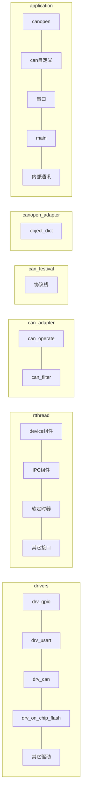
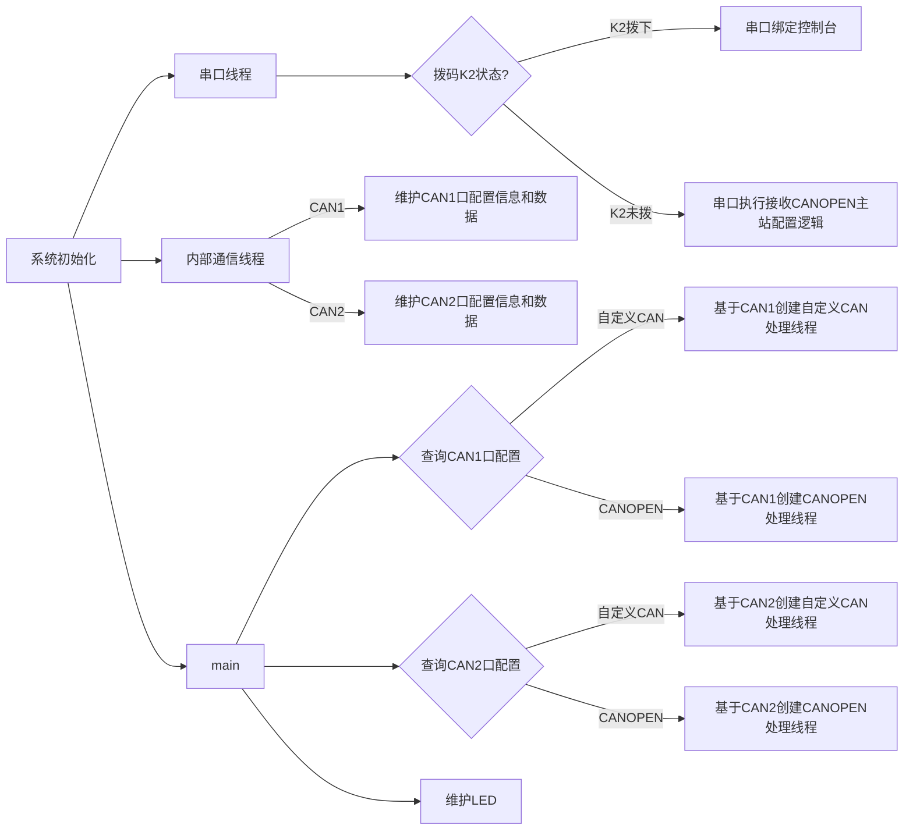
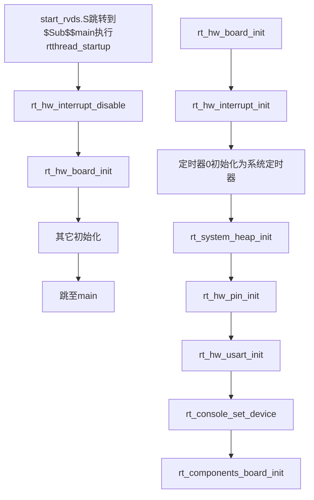
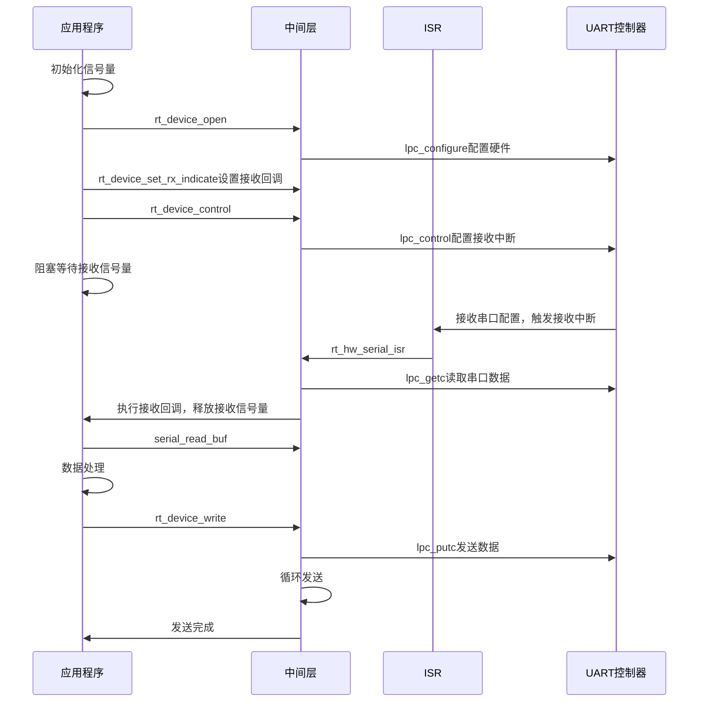
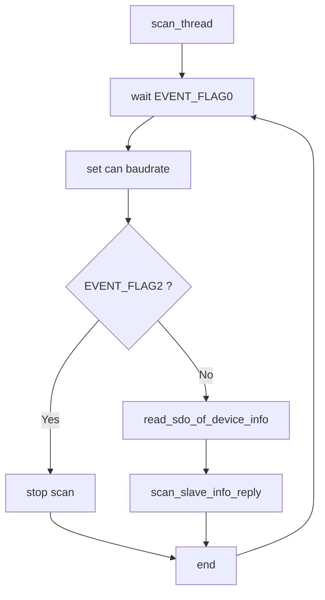
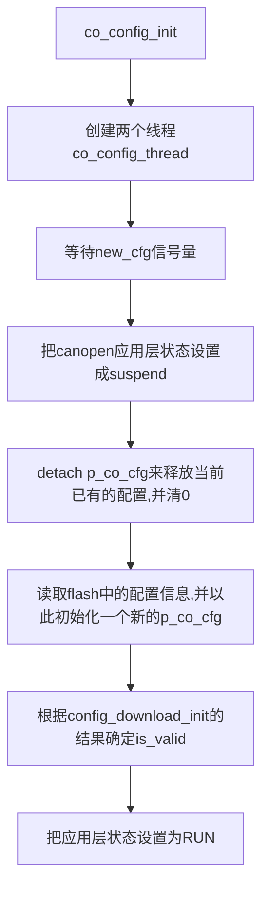
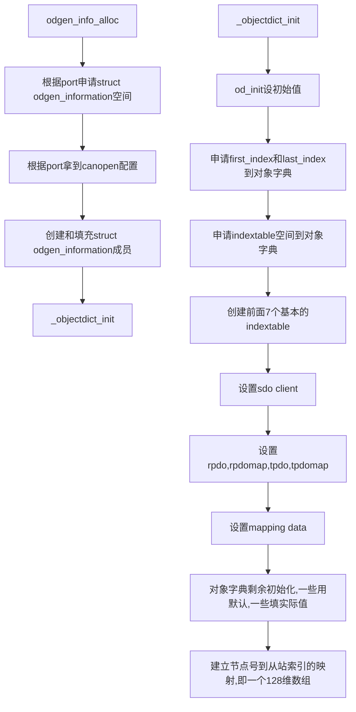
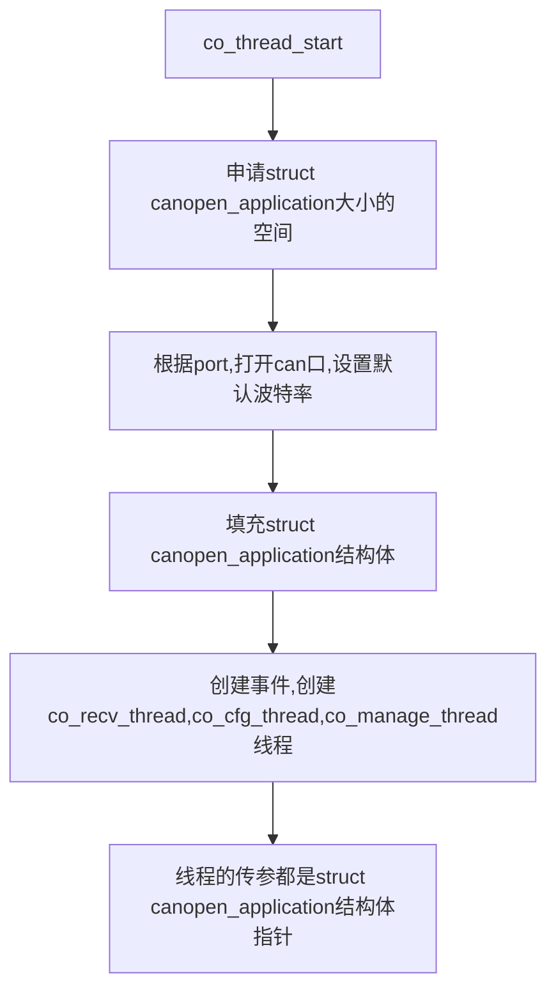
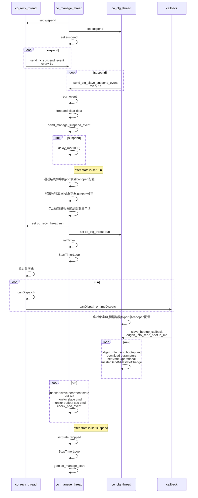

# 系统设计过程

## 需求分析

本次重构CANOPEN模块

需求：

1. 模块支持配置两个CAN口都是CANOPEN主站的情况。
2. 模块有较好的可移植性，做到只需修改板级信息即可。
3. 模块有调试口。

分析：

1. 需求1需要系统维护两个对象字典，所以应利用实时系统通过不同的线程分别维护各自的对象字典。
2. 需求1需要能下载两种主站配置，考虑配置软件通过报头来区别。
3. 需求2需要系统进行分层设计，对应到rt-thread中就是应用层基于device组件开发，驱动层开发符合device组件规范。
4. 对需求2进行拓展，考虑系统功能的可裁剪性，源码目录增加Kconfig支持。
5. 对需求3目前可以通过后置拨码K2来确定是否启用调试口，默认调试口关闭，串口为下载配置口。

## 系统整体设计框图

### 系统结构框图




### 系统流程框图



## 系统各部分细节设计框图

### 驱动明细

对于rt-thread已经可以支持的设备device组件应基于device组件来实现，具体包括：

1. 串口驱动
2. CAN驱动
3. 硬件定时器(timer1)驱动
4. GPIO驱动
5. 外部ram驱动，需上电完成初始化

其余device组件不支持，但是需要的驱动：

1. 看门狗驱动
2. 内部flash读写驱动

### HIN线程


### 串口线程

待添加

### CAN自定义线程

待添加

### CAN OPEN线程

canfestival的执行流程可以参照官方说明文档，如下


# 系统实现过程

## 工程设置

1. 目录

考虑到可扩展性，这里采用与STM32相同的目录设置

- applications是应用层代码
- board根目录下关于系统时钟初始化
- linker_scripts为链接脚本
- ports中存放底层驱动
- build和Listings为生成文件存放区
- libcpu目录下存放lpc2294相关的启动文件

```
├─bsp
│  └─lpc2294
│      ├─applications
│      ├─board
│      │  ├─linker_scripts
│      │  └─ports
│      ├─build
│      │  └─kernel
│      │      ├─components
│      │      └─libcpu
│      └─Listings
├─libcpu
│  └─arm
│      ├─lpc2294
```

2. 工程配置

因为需要在外部ram中跑系统，所以手动加载链接文件，文件目录为`.\board\linker_scripts\link.sct`，内容如下，外部ram其实地址为0x80000000，大小为1MB，内部ram区命名为`RAM_D1`：

```
; *************************************************************
; *** Scatter-Loading Description File generated by uVision ***
; *************************************************************

LR_IROM1 0x00000000 0x00040000  {    ; load region size_region
  ER_IROM1 0x00000000 0x00040000  {  ; load address = execution address
   *.o (RESET, +First)
   *(InRoot$$Sections)
   .ANY (+RO)
   .ANY (+XO)
  }
  RW_RAM1 0x80000000 0x00100000  {  ; RW data
   .ANY (+RW +ZI)
  }
  RW_IRAM1 0x40000000 UNINIT 0x00004000  {
   *(.RAM_D1)
  }
}
```

编译选项：

- [x] Enable ARM/Thumb Interworking
- [x] One ELF Section per Function
- [x] C99 Mode

## 汇编启动文件设置

基本情况：`canopen`需要将配置写到内部flash，这个写`flash`算法需要用到片内`ram`，在内部资源不足的情况下，片内`ram`应该空出来，所以希望系统本身用外部的1M ram。

- 汇编启动文件设置分频同裸机一样，到66Mhz
- 汇编启动文件初始化外部`sram`(首先需要在`keil`中加上宏`EXTERNAL_MODE`，然后初始化)，系统的`memheap`初始化也基于外部`sram`(要注意生成的`sct`文件中`ram`的名字，`memheap`初始化要匹配)。
- 后期可扩展性考虑？做Kconfig，外部`ram`根据名字可配？不同的芯片进行不同的ram初始化。

设置步骤：

1. 外设总线分频 VPBDIV=1,外设时钟频率与处理器时钟一样

2. PLL锁相环配置PLLCFG = 0x25(倍频MSEL 5+1倍，分频PSEL为1)

3. 设置`PINSEL2_Val=0x0d000114`，`BCFG0_val=0x10001440`即可初始化外部ram
4. 将修改好的文件替换libcpu/arm/lpc2294的启动文件
5. 修改bsp/lpc2294目录下的rtconfig.py,ARCH指定为`arm`,CPU指定`lpc2294`,CROSS_TOOL指定为`keil`，`armcc`下的LFLAGS修改为`LFLAGS = DEVICE + ' --info sizes --info totals --info unused --info veneers --list rtthread-lpc2294.map --scatter "board\linker_scripts\link.sct"'`
6. 在模板工程中ASM define中添加`DEXTERNAL_MODE`宏。

## 系统启动流程设置



系统启动流程中，主要关注`rt_hw_board_init`。`rt_system_heap_init`需要指定ram的起始和结束地址。往后根据配置宏进行选择性初始化。

## 调试口设置

基本情况：开发板只有一个串口，但这个串口需要下载上位机的配置，又需要方便调试，所以使用拨码开关K2。

- 拨码开关拨下来(该口置低电平)的时候使用调试口，默认不拨。

## 驱动设置

考虑采用分层设计，实际中基于device组件来实现：

- GPIO驱动
1. 在board/Kconfig中添加如下GPIO的配置选项

    ```python
    config BSP_USING_GPIO
        bool "Enable GPIO"
        select RT_USING_PIN
        default y
    ```

2. 在board/SConscript中添加如下内容

    ```python
    if GetDepend(['RT_USING_PIN']):
        src += ['ports/drv_gpio.c']
    ```
3. GPIO驱动主要实现函数如下：    ```
	```c
   const static struct rt_pin_ops pin_ops =
	{
	    lpc_pin_mode,
	    lpc_pin_writc,
	    lpc_pin_read,
	    lpc_pin_attach_irq,		//未实现
	    lpc_pin_dettach_irq,	//未实现
	    lpc_pin_irq_enable,		//未实现
	};
	```
- 串口驱动
1. 在board/Kconfig中添加如下GPIO的配置选项

    ```python
    menuconfig BSP_USING_UART
        bool "Enable UART"
        default y
        select RT_USING_SERIAL
        if BSP_USING_UART
            config BSP_USING_UART0
                bool "Enable UART0"
                default y

            config BSP_USING_UART1
                bool "Enable UART1"
                default n
        endif
    ```

2. 在board/SConscript中添加如下内容

    ```python
    if GetDepend(['RT_USING_SERIAL']):
        src += ['ports/drv_usart.c']
    ```
3. 串口驱动主要实现函数如下：
	```c
    static const struct rt_uart_ops lpc_uart_ops =
    {
        .configure = lpc_configure,
        .control = lpc_control,
        .putc = lpc_putc,
        .getc = lpc_getc,
        .dma_transmit = RT_NULL
    };
    void USARTx_IRQHandler(int32_t irqno, void *para)
	```
- can驱动
1. 在board/Kconfig中添加如下GPIO的配置选项

    ```python
    menuconfig BSP_USING_CAN
        bool "Enable CAN"
        default n
        select RT_USING_CAN
        if BSP_USING_CAN
			config BSP_USING_CAN1
				bool "Enable CAN1(P0.25-Rx/P0.26-Tx)"
				default y 
			config BSP_USING_CAN2
				bool "Enable CAN2(P0.23-Rx/P0.24-Tx)"
				default y 
			config BSP_USING_CAN3
				bool "Enable CAN3(P0.21-Rx/P0.22-Tx)"
				default n 
			config BSP_USING_CAN4
				bool "Enable CAN4-HIN(P0.12-Rx/P0.13-Tx)"
				default y 				
        endif
    ```

2. 在board/SConscript中添加如下内容

    ```python
    if GetDepend(['RT_USING_CAN']):
        src += ['ports/drv_can.c']
    ```

3. CAN驱动主要实现函数如下：

    ```c
    static const struct rt_can_ops can_ops =
    {
        lpc_can_configure,
        lpc_can_control,
        lpc_can_send_msg,
        lpc_can_recv_msg,
    };
    void CANx_RX_IRQHandler(int32_t irqno, void *para)
    void CANx_TX_IRQHandler(int32_t irqno, void *para)
    void CAN_ERR_IRQHandler(int32_t irqno, void *para)
    ```
    
4. can滤波设置

    LPC CAN滤波器支持标准帧、扩展帧单ID滤波设置和组ID滤波设置，滤波器ID设置规则为：fcan_cell --> sff_indv_cell --> sff_grp_cell --> eff_indv_cell --> eff_grp_cell , 各控制器的同一类cell内的滤波ID需要从小到大的顺序排列，并且各控制器的同一类cell需要根据控制器号依次排列。例如：

    CAN1需要滤波的sff_indv_id	：0x02	0x01	0x03

    CAN1需要滤波的sff_grp_id	：0x07-0x08	0x04-0x05

    CAN2需要滤波的sff_indv_id	：0x07	0x06	0x08

    CAN2需要滤波的sff_grp_id	：0x04-0x05	0x01-0x03

    则CAN滤波器Table为：	

    ​	sff_indv			CAN1				0x01

    ​	sff_indv			CAN1				0x02

    ​	sff_indv			CAN1				0x03

    ​	sff_indv			CAN2				0x06

    ​	sff_indv			CAN2				0x07

    ​	sff_indv			CAN2				0x08

    ​	sff_grp			CAN1				0x04-0x05

    ​	sff_grp			CAN1				0x07-0x08

    ​	sff_grp			CAN2				0x01-0x03

    ​	sff_grp			CAN2				0x04-0x05

    主要结构体定义：
    
    ```c
    //应用层
    struct app_can_filter_item_def
    {
        uint16_t sff_indv_num;
        uint16_t sff_grp_num;
        uint16_t eff_indv_num;
        uint16_t eff_grp_num;
    
        uint16_t sff_indv_id[MAX_INDV_FILTER_NUM];
        uint16_t sff_grp_id[MAX_GRP_FILTER_NUM][2];
        uint32_t eff_indv_id[MAX_INDV_FILTER_NUM];
        uint32_t eff_grp_id[MAX_GRP_FILTER_NUM][2];
    };
    
    //驱动层
    typedef struct sff_tab_def
    {
    	uint32_t up_id	:11;	// 11bit ID1
    	uint32_t up_rsv	:1;		//
    	uint32_t up_dis	:1;		// 禁能位
    	uint32_t up_ch	:3;		// CAN控制器号
    	
    	uint32_t lo_id	:11;	// 11bit ID0
    	uint32_t lo_rsv	:1;		//
    	uint32_t lo_dis	:1;		// 禁能位
    	uint32_t lo_ch	:3;		// CAN控制器号    
    }sff_indv_tab_def,sff_grp_tab_def;
    
    typedef	struct	eff_tab_def
    {
    	uint32_t id		:29;	// 29bit EFF ID
    	uint32_t ch		:3;		// CAN控制器号
    }eff_indv_tab_def;
    
    typedef struct eff_grp_tab
    {
        struct	eff_tab_def lo;
        struct	eff_tab_def up;
    }eff_grp_tab_def;
    ```
    
    ```c
    uint8_t app_set_sff_indv_tab(uint16_t id, enum can_port port)
    ```
| 参数 | 描述 |
| --- | --- |
| id | sff_indv_id |
| port | CAN端口 |
| 返回 | -- |
| RT_EOK | -- |

```c
uint8_t app_set_sff_grp_tab(uint16_t lo_id, uint16_t up_id, enum can_port port)
```


```
uint8_t app_set_eff_indv_tab(uint32_t id, enum can_port port)
```


```
uint8_t app_set_eff_grp_tab(uint32_t lo_id, uint32_t up_id, enum can_port port)
```


    ```c
    uint8_t app_set_sff_grp_tab(uint16_t lo_id, uint16_t up_id, enum can_port port)
    ```
    
    ```c
    uint8_t app_set_eff_indv_tab(uint32_t id, enum can_port port)
    ```
    
    ```c
    uint8_t app_set_eff_grp_tab(uint32_t lo_id, uint32_t up_id, enum can_port port)
    ```

因device组件缺少支持而直接由上层调用底层的驱动有：

- 写内部flash驱动
- 看门狗驱动

## 应用层设置


### 串口下载配置

  - 主要结构体定义：
    ```c
        struct hw_serial_config_info
        {
          struct rt_semaphore         serial_rx_sem;	//接收信号量
          struct serial_configure     rt_hw_serial_cfg;	//串口硬件配置
          uint16_t                    onebyte_time;		//单字节传输间隔时间
        };

      struct serial_configure
      {
          rt_uint32_t baud_rate;					//波特率
          rt_uint32_t data_bits               :4;	//数据位
          rt_uint32_t stop_bits               :2;	//停止位
          rt_uint32_t parity                  :2;	//奇偶校验
          rt_uint32_t bit_order               :1;	//bit 传输顺序	LSB first sent
          rt_uint32_t invert                  :1;	//传输模式		normal mode
          rt_uint32_t bufsz                   :16;  //buf大小		 64byte
          rt_uint32_t reserved                :6;	//0
      };

      struct serial_scan_def
      {
          rt_thread_t         thread_id;	//扫描处理线程ID
          enum can_port       ch;			//can端口
          struct rt_event     event;		//扫描事件
          enum CANBAUD        baudrate;	    //扫描波特率
      };
    ```
    
  - 串口配置下载线程由主线程创建并启动：
serial_thread_entry()软件流程图:
  ```mermaid
graph TD
A[malloc接收缓存] --> B[sem_init,配置串口,设置接收回调] --> C[创建scan_thread] --> D[等待serial_rx_sem] --> E[校验报头] --> F[code]
	F --> |DOWNLOAD_CODE| E2[download_code_handler] --> E3[write flash] --> E4[release p_config_write_sem]--> M[串口响应]
	F --> |START_SCAN_CODE| G2[start_scan_code_handler] --> G3[send EVENT_FLAG0] --> M[串口响应]
	F --> |STOP_SCAN_CODE| H2[stop_scan_code_handler]-->H3[send EVENT_FLAG2]--> M[串口响应]
	F --> |SCAN_REPLY| I2[scan_reply_handler] --> I3[send EVENT_FLAG1] --> M[串口响应]
	F --> |...| J2[...] --> J3[...] --> M[串口响应]
	F --> |RESET_SLAVE| K2[reset_slave_handler] --> K3[send sem] --> M[串口响应] --> D
  ```
serial_thread_entry()软件时序图:




serial_scan_thread_entry()软件流程图:

### HIN通信
  - 主要结构体定义
```c
struct hin_message
{
    uint16_t    size;					//数据大小
    uint8_t     node;					//节点地址
    uint8_t     state;					//数据状态
    uint8_t     data[HIN_REV_BUF_LEN];	//HIN_REV_BUF_LEN = (1024 * 2)
};

struct hin_can_recv_def
{
    uint16_t count;
    uint8_t  status;
    uint8_t  dst;
    uint8_t  src;
    uint8_t  serial;
    uint16_t  size;
};
```
  - HIN通讯线程由主线程创建并启动：

    hin_process_thread()软件流程图:
    
    ```mermaid
    graph TD
    a[malloc收发数据缓存] --> c[open can,设置接收回调] --> d[set can filter]
    	d --> d1[wait can_app.p_sem] --> d2[读取CAN报文并打包] --> e[hin_message_process]
    	e --> f1[CODE_COMLOAD/CODE_COMACQ] --> I[CAN响应] --> d1
    	e --> g1[CODE_COMCMD] --> g2[数据拷贝] --> I[CAN响应]
    	e --> h1[CODE_TIMESET] --> d1
    ```
    hin_process_thread()软件时序图:
    ```mermaid
    sequenceDiagram
    participant 应用程序
    participant 中间层
    participant ISR
    participant CAN控制器
        应用程序->>中间层:app_open_can
    	中间层->>CAN控制器:lpc_can_configure
    	应用程序->>应用程序:初始化信号量
        应用程序->>中间层:rt_device_set_rx_indicate设置接收回调
        应用程序->>中间层:app_control_can设置波特率
        中间层->>CAN控制器:lpc_can_control
        应用程序->>应用程序:阻塞等待接收信号量
        CAN控制器->>ISR:接收到一帧数据并触发CAN接收中断
        ISR->>中间层:rt_hw_can_isr
        中间层->>CAN控制器:lpc_can_recv_msg
        中间层->>应用程序:执行接收回调，释放接收信号量
    	应用程序->>中间层:app_read_can读取数据
        应用程序->>应用程序:数据打包、处理
        应用程序->>中间层:app_write_can
        中间层->>CAN控制器:lpc_can_send_msg
        中间层->>中间层:等待数据发送完成
        CAN控制器->>ISR:触发发送完成中断
        ISR->>中间层:rt_hw_can_isr
        中间层->>应用程序:发送完成
    ```


### CANOPEN配置信息

#### 代码介绍

canopen的配置信息结构体如下：

```c
struct canopen_config
{
    struct canopen_download     parent;
    uint32_t                    is_valid;
    uint32_t                    config_flash_addr;
    enum can_port               port;
    uint8_t                     *p_iram_buff;
    rt_sem_t                    p_newcfg_sem;
};
typedef struct canopen_config *co_cfg_t;
```

其中父类成员结构体`struct canopen_download`以及其内部包含的子结构体由文件夹canopen_config来维护，文件夹中包含以`config_`作为前缀的文件，实现了结构体成员访问的所有接口。以`canopen_download`做父类主要方便强转，由父类也能直接找到`port`。



#### 代码测试

该部分代码测试主要包括

- 配置初始化正确，不同平台移植时，应注意结构体设置1字节对齐。
- 重复初始化没有内存泄漏。通过在`msh`调用`cfg_reset`命令，执行配置重新初始化，观察系统内存占用是否发生变化。

这个测试代码需要会检测全局配置指针非空，空的时候则调用配置初始化，否则直接释放信号量。测试之前最好把canopen应用层启动代码取消掉，否则出问题时会增加排查难度。

### CANOPEN对象字典

#### 代码介绍

canopen的odgen_info结构体如下:

```c
struct odgen_infomation
{
    CO_Data         parent;
    enum can_port   port;
    uint16_t        odindexs[MAX_OD_INDEX_NUM];
    uint32_t        array_index;
    uint16_t        slave_guard_time;
    uint8_t         slave_lifetime_factor;
    uint8_t         consumer_heartbeat_num;
    int8_t          nodeid_2_slave_index[NMT_MAX_NODE_ID];
    rt_sem_t        p_sdo_sem;//read write sdo
    void*           p_sdo_data;//sdo read data
    rt_mq_t         p_bootup_mq;//for send bootup nodeid
    uint8_t         rpdo_buffin[HIN_BUFF_IN_SIZE];
    uint8_t         tpdo_buffout[HIN_BUFF_OUT_SIZE];
};
typedef struct odgen_infomation *odgen_info_t;
```

其中对象字典是该结构体的父类，这样做的好处是可以通过对象字典直接拿到`odgen_infomation`结构体中的成员，便于canfestival协议栈中从站上线、读写SDO的执行。此外这里需要说明`rpdo_buffin`和`tpdo_buffout`为何放在该处，因为生成对象字典在进行设置`mapping`时，需要pdo数据区，如果这个数据区统一给`canopen_app`来维护就会导致生成对象字典需要依赖`canopen_app`先初始化，于是为了降低该处的耦合，把pdo数据区与由`canopen_app`管理的从站状态区分开，也有利于分开独立测试。



#### 代码测试

测试主要包括：

- 根据CANOPEN的配置信息生成正确的对象字典；
- 对象字典在运行过程中可能需要申请和释放，要注意内存泄漏的问题。通过在`msh`中调用`od_gen`和`od_free`，观察系统内存的变化情况。

### CANOPEN应用

CANOPEN主要应用逻辑在`canopen_app.c`中实现，主要为内部通信提供接口来交换数据，此外提供对canopen_manage_thread的控制实现对象字典的重载。

#### 代码介绍

canopen的canopen_application结构体如下

```c
struct canopen_application
{
    uint8_t                                 buffin[(NMT_MAX_NODE_ID + SDO_USED_WORDLEN) * 2];//slave_cmd max is NMT MAX NODE ID
    uint8_t                                 buffout[(NMT_MAX_NODE_ID + SDO_USED_WORDLEN) * 2];//and sdo use 7 word
    
    struct canopen_buffin_information       buffin_info;
    struct canopen_buffout_information      buffout_info;

    enum                                    can_port port;
    CO_Data                                 *p_od;
    
    /*recv thread info*/
    rt_thread_t                             p_co_app_recv_tid;
    e_app_tid_state_t                       e_co_app_recv_tid_state;

    /*manage thread info*/
    rt_thread_t                             p_co_app_manage_tid;
    e_app_tid_state_t                       e_co_app_manage_tid_state;

    /*config slave node thread info*/
    rt_thread_t                             p_co_app_cfg_tid;
    e_app_tid_state_t                       e_co_app_cfg_tid_state;

    /*for check recv and manage state*/
    rt_event_t                              p_co_app_event;
    
    /*canopen led*/
    rt_base_t                               co_run_led;
    rt_base_t                               co_dn_led;
    rt_base_t                               co_err_led;
};
typedef struct canopen_application *co_app_t;
```

这里，`buffin`和`buffout`主要存放从站的状态和sdo命令，因此这里按从站数量最大时所需要的空间申请。结构体`struct canopen_buffin_information`和`struct canopen_buffout_information`主要指示各状态、SDO、PDO的位置，其余成员为应用逻辑执行中所需要的状态。



CANOPEN应用运行流程




内部总线数据区的排布方式为：

| BUFF_IN(uint16_t)                   | BUFF_OUT(uint16_t)                 |
| ----------------------------------- | ---------------------------------- |
| slave state                         | slave 命令                         |
| ...(slave state占slave num个数据区) | ...(slave 命令占slave num个数据区) |
| 接收sdo状态                         | 发送sdo命令                        |
| 接收sdo node id                     | 发送sdo node id                    |
| 接收sdo index                       | 发送sdo index                      |
| 接收sdo subindex                    | 发送sdo subindex                   |
| 接收sdo 数据长度                    | 发送sdo 数据长度                   |
| 接收sdo数据01字节                   | 发送sdo数据01字节                  |
| 接收sdo数据23字节                   | 发送sdo数据23字节                  |
| 接收从站发的tpdo                    | 发送从站收的rpdo                   |
| ...                                 | ...                                |


#### 代码测试

主要测试包括：

- canopen功能测试
- 重新加载时的内存泄漏测试，通过`msh`输入`stop_canopen`和`start_canopen`查看系统内存占用情况，或者使用nabuilder重新下载相同的配置，并且不复位，因为新的配置来了以后模块会重启协议栈，此可查看系统内存占用是否依然不变。


## 代码架构

- 与`rtthread`的关系，比如想要更新`rtthread`到最新的版本，那理论上应该添加一个`bsp`包过去，再加上必要的启动文件修改即可。但是好像`memheap`初始化那边肯定需要修改代码；
- 与`canfestival`的关系

