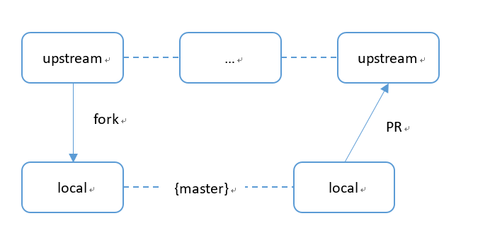
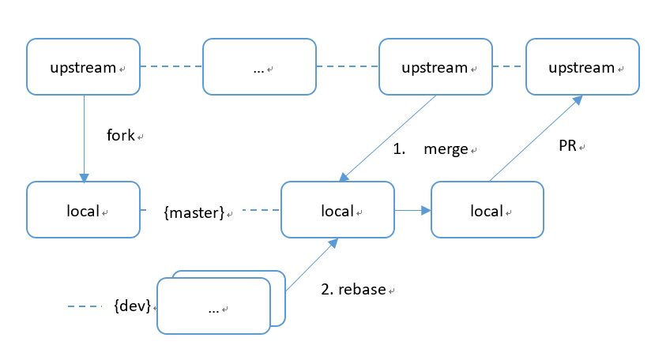

# Gogs pull request 规则
---------------------------------------------------------------
向Gogs远程服务器中的仓库提交代码，提交PR请遵循以下事项:
+ 不同的功能请分开提交，不要把不相关的修改一次性提交；
+ 提交时的message请使用英文描述，不要出现中文；
+ git commit 提交格式：type [scope]:subject  
    + type：用于说明commit的类别，规定为如下几种：    
        | type | 说明 |
        |:---- |:-----|
        | feat | 新增功能 |
        | fix | 修复bug|
        | doc | 修改文档|
        | refactor |代码重构，未新增任何功能和修复任何bug|
        | build |改变构建流程，新增依赖库、工具等(例如webpack修改)|
        | style |仅仅修改了空格、缩进等，不改变代码逻辑|
        | perf |改善性能和体现的修改|
        | chore |非src和test的修改|
        | test |测试用例的修改|
        | ci |自动化流程配置修改|
        | revert |回滚到上一个版本|
    + scope：[可选] 问题单的单号
    + subject：commit的简要说明，尽量简短
+ PR的标题请简单说明这次提交PR的内容

# PR提交代码重点注意事项
---------------------------------------------------------------------
+ 请优先检查代码风格
    + 移植的代码，请尽量保持原有代码，改动部分尽量少；
    + 和原项目适配的代码，请遵循原项目的代码风格。

以下代码是不妥的，会被拒绝合并到PR中：  
1. 缩进不一致
```
void func(int parameter)
{
    int a;

        if (parameter < 0)
        {
            /* ... */
        }
}
```
if语句和前面的缩进不一致；

2. 包含不必要的代码
```
void func(int parameter)
{
#if 0
    /* ... */
#endif

#if 1
    /* ... */
#endif
}
```
代码中不管是#if 0还是#if 1，都不应该存在。提交上来的代码，都代表着这是一份正式的代码。

# 自己的git分支维护
------------------------------------------------------------------
  

向仓库中提交PR的通常做法是：  
从upstream主线总fork一份代码到自己的github仓库中。然后在自己的github仓库中进行修改，并进行提交（注意，这里只能提交到自己的github仓库中，而upstream仓库一般并无直接提交修改的权限）。当进行到一定时候，希望自己的修改能更新到upstream主干中，这个时候可以在github上发起一份PR（pull request），请求upstream的维护人合并这部分的修改。如果upstream维护人确认没问题，修改的补丁将自动合并到upstream主干中。  

但有的时候，自己维护的git仓库可能会出现混乱。例如：当upstream仓库已经进行改动了，然后再把upstream的改动合并到自己的仓库，这样有可能出现冲突（例如修改了相同的一份文件）。当冲突解决时，再提PR到upstream时，可能会携带一系列的提交记录。  

当要把自己的改动提PR到upstream去进行合并时，可能就会出现这样反复修改的记录。


一般比较好的做法是，保留master分支不动，在自己的仓库中另外创建一个分支，例如你自己的dev分支：
```
# 创建一份dev分支，并切换过去
git checkout -b dev
```

后续相关的修改都在你自己的分支上进行，而不牵涉到master分支。当需要合并到master分支时，先把upstream的最新更改合并到master分支上，然后再在master分支上做rebase，如下图所示。
  

相关的一些git命令说明： 
```
# 先切换回master分支
git checkout master

# 抓取upstream更改，然后合并到本地master分支上
git fetch upstream
git merge upstream/master

# 把dev分支的更改rebase合并到master分支上
git rebase dev

# 把本地更改提交到github上自己的分支
git push origin
```